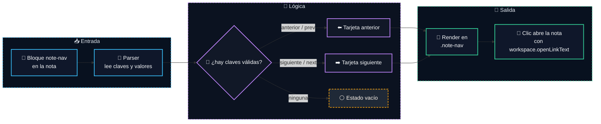

# 📝 Note Nav Cards

      

Plugin de Obsidian para crear tarjetas de navegación entre notas con un bloque de código bastante directo. La idea es simple: defines la nota anterior, la siguiente o las dos, y el plugin se encarga de montar la UI usando la API nativa de Obsidian para procesar bloques Markdown, abrir enlaces internos y exponer ajustes sin complicarte demasiado.

## ✨ Qué hace

- Procesa bloques de código `note-nav`.
- Acepta claves en español e inglés.
- Renderiza una tarjeta para nota anterior, nota siguiente o ambas.
- Usa la API de Obsidian para resolver y abrir enlaces internos.
- Aplica estilos adaptativos a tema claro y oscuro.

## 🧩 API de Obsidian utilizada

| API                                  | Uso                                                      |
| ------------------------------------ | -------------------------------------------------------- |
| `Plugin`                             | Clase base del plugin, carga de ajustes y ciclo de vida. |
| `registerMarkdownCodeBlockProcessor` | Registro del bloque `note-nav` y su renderizado.         |
| `PluginSettingTab`                   | Construcción de la pestaña de configuración.             |
| `Setting`                            | UI del ajuste de color principal.                        |
| `Notice`                             | Feedback puntual para acciones de la configuración.      |
| `workspace.openLinkText`             | Apertura de la nota enlazada desde la tarjeta.           |

## 📐 Sintaxis del bloque

El bloque admite pares clave-valor separados por dos puntos. El parser solo acepta claves válidas y descarta el resto.

### Claves soportadas

| Clave       | Alias  | Descripción                     |
| ----------- | ------ | ------------------------------- |
| `anterior`  | `prev` | Nota anterior en la secuencia.  |
| `siguiente` | `next` | Nota siguiente en la secuencia. |

### Ejemplos

Navegación completa:

````text
```note-nav
anterior: Nota anterior
siguiente: Nota siguiente
```
````

Solo siguiente:

````text
```note-nav
siguiente: Primera nota del tema
```
````

Solo anterior:

````text
```note-nav
anterior: Nota anterior
```
````

Claves en inglés:

````text
```note-nav
prev: Previous note
next: Next note
```
````

## ⚙️ Flujo de renderizado



## 🧠 Comportamiento

- El título de cada tarjeta debe coincidir con el nombre real de la nota en el vault.
- El procesador utiliza `sourcePath` para resolver la navegación en contexto.
- Si solo existe una dirección, solo se renderiza esa tarjeta.
- Si no hay ninguna nota válida, se muestra un mensaje de estado vacío.
- El componente se renderiza tanto en lectura como en previsualización de Markdown.

## 🎨 Estilo y tema

El componente separa estructura y presentación mediante clases CSS específicas y variables reutilizables.

- El color principal se expone como variable CSS del plugin.
- Las tarjetas adaptan bordes, sombras e iconos al color de acento.
- Los estilos incluyen variantes para tema claro y oscuro.
- La hoja de estilos está dividida por responsabilidades: variables, tarjetas, ajustes y responsive.

## 🛠️ Configuración

El plugin expone un único ajuste visible:

| Ajuste          | Descripción                                                   | Valor por defecto |
| --------------- | ------------------------------------------------------------- | ----------------- |
| Color principal | Define el acento visual de iconos, bordes, brillos y sombras. | `#2ea8ff`         |

## 🧪 Desarrollo local

El proyecto usa CommonJS y esbuild para generar el bundle final del plugin.

### Dependencias

```bash
npm install
```

### Compilación

```bash
npm run build
```

### Modo desarrollo

```bash
npm run dev
```

## 🗂️ Estructura del proyecto

```text
note-nav-cards/
├── main.js                      // Archivo principal del plugin generado por esbuild
├── styles.css                   // Archivo de estilos generado por esbuild
├── manifest.json                // Metadatos del plugin
├── package.json
├── package-lock.json
├── README.md
├── scripts/                     // Scripts de build
│   ├── build.js
│   └── build-styles.js
└── src/                         // Código fuente del plugin
    ├── main.js
    ├── components/
    │   └── note-nav-card.js
    ├── processors/
    │   └── note-nav-processor.js
    ├── settings/
    │   ├── default-settings.js
    │   └── settings-tab.js
    ├── styles/
    │   ├── cards.css
    │   ├── css-vars.js
    │   ├── responsive.css
    │   ├── settings.css
    │   └── variables.css
    └── utils/
        └── parse-config.js
```

## ✅ Compatibilidad

- Obsidian 1.5.0 o superior.
- Escritorio y móvil.

## 👤 Autor

**David Torró**

Nació como un proyecto personal para usarlo en mi propio vault de Obsidian.

Lo dejo publicado por si a alguien más le interesa, le sirve como base o le da ideas para montar su propia navegación entre notas.

## 💬 Apoyo y contribuciones

Si te sirve este plugin, puedes ayudar de forma muy simple:

- Dale una estrella al repositorio.
- Abre una issue si detectas un fallo o una mejora.
- Abre una pull request si quieres proponer cambios.
- Comparte feedback si lo estás usando en tu vault.

## 🔗 Obsidian

<!-- Añadir aquí el enlace oficial del plugin cuando se publique -->

## ⚖️ Licencia

Este proyecto se distribuye bajo licencia MIT. Puedes usarlo, modificarlo y redistribuirlo con los términos habituales de MIT.
